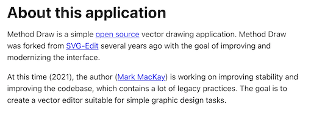

# SVG editors

Ideally, one would have a ☐ free and ☐ graphical SVG editor that ☐ is able to read/write the local files, in the git repo (no upload/download).

Such an editor could either be ☐ supported on multiple OSes (and behave like a native app) or ☐ be a web app with capabilities to read/write local files (specific paths only).

Does this exist?

Here are the candidates.

<!-- More dreams:
Would be cool to have an iPad app that edits resources directly, on GitHub!

- with leaving the constraints in the files; eg. changing colors and what-not
- merging takes care of constraints vs. visuals (assuming no conflicts); since git handles changes line-wise, constraints must always be on their separate lines; not inline
-->

## Vecteezy editor

- [https://www.vecteezy.com/editor](https://www.vecteezy.com/editor)

Nice web tool. Free.

Their main business is photo/video content licensing; the editor has a support role.

Does not support access to local file system. 🙁

## Vectr.com

Online, and Windows / Linux.

- Really fun interactive tutorials! ⭐️⭐️⭐️
- Snappy
- Has guiding lines

>Vectr’s basic graphics editor is free forever. 

Going with this!!!

It does not have a macOS native install, but can try it out on Windows.

>I **almost** was into this, and then:
>
>- Windows app has adds (is that weird?)
>- Windows app requires me to "login" to do ... anything?
>
>You lost me at the final yards... 

- [ ] Twitter account mentions a Mac client. Whassup?

   >Free collaborative vector graphics editor for web and Mac, Windows, Linux, and Chromebook.

## Method SVG 🥇

- [https://editor.method.ac](https://editor.method.ac)

🎖 Winner!

- simple
- snappy
- web only <small>but maybe the author would welcome the [File System Access API](https://caniuse.com/native-filesystem-api), at some point??</small>

>
 

## Others

Editors we're aware of, but skipped (and why).

|product|what was wrong?|
|---|---|
|Boxy&nbsp;SVG|Being able to read/write local file system requires "registration" and USD 9.99/year.|
|Inkscape|Nope. Version 1.1 *still* doesn't feel native on macOS, and that's a deal breaker.|

## Resources

- [31 great free & paid SVG editors for UX designers](https://www.justinmind.com/blog/best-free-paid-svg-editors-download-online/) (blog, Aug 2020)

