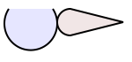

# Just solve

<!-- Root README: 
- visible in GitHub
- for developers; explains how to build and test the project
-->



<!-- Update the logo, once we get further; even making it interactive :).
-->

Adds geometerical constraints to SVG.


## Requirements

- node

<!--
Developed on:

macOS 11.4
node 16.2
npm 7.13
-->


## Getting started

```
$ npm install
```

```
$ npm run dev 
```

Open a browser at [localhost:5000](http://localhost:5000). 


## Prior art

- [SolveSpace](https://solvespace.com/index.pl)

   A solver (and CAD program) created in C++. The solver is said to be separatable from the UI app.

<!-- #later
## References

-
-->
