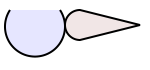

# just-solve

<!-- tbd. enable when published
[](https://packagephobia.com/result?p=just-solve)
-->

<!-- package/README.md
- visible in npm registry
- for users; explains how to import and use the package
-->



<!-- Note: 'https://www.npmjs.com/package/aside-keys' needs an absolute path to the picture.
	- 
	-->

Adds geometerical constraints to SVG.

Start editing an SVG vector drawing and you'll notice how easily they break. Move one ellipse and its adjacent parts won't follow along. The whole intention is lost.

This tool changes that. It provides a way to constrain the shapes with each other - just like CAD systems do.

Possible application areas:

- 2D mechanical drawing
- parametric logos / fonts etc. 
- ...you name it!


## Features

- integrates with normal SVG workflows, so that *visual aspects* can be edited with graphical SVG editors
- constraints can be defined *declaratively* alongside SVG (`data-*` parameters of SVG 2.0 help with this)
- prepared for SVG 2.0 but useful with (existing) SVG 1.1

### Browser requirements

- ES6 capable (ever-green) browser

<!-- 
## Playground

tbd. Once deployed, have a link here to a live playing field. :)
-->


## Using in your project

```
$ npm install just-solve
```

*tbd. once we have an implementation..*

<!-- hint: see how `aside-keys` has this
-->

<!--
## References

-->